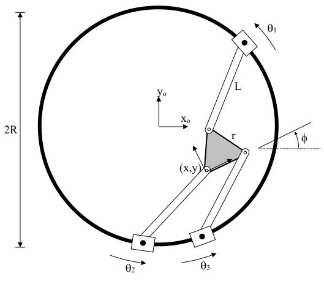
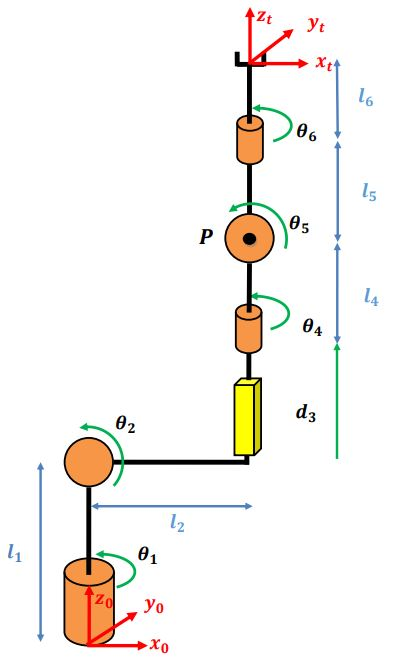
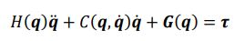
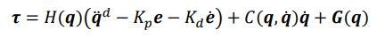
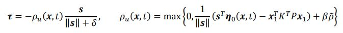

🤖 Advanced Robot Kinematics, Dynamics & Nonlinear Control

Parallel Robot:

Serial Robot:

------------------------------------------------------------
🧭 Overview
------------------------------------------------------------
This project explores the kinematics, dynamics, and nonlinear control of both serial and parallel robots.
It provides analytical, simulation, and control solutions for complex robotic mechanisms, focusing on
MIMO (Multi-Input Multi-Output) nonlinear control laws such as:

• Min-Max control  
• Inverse Dynamics (ID) control  
• Feedback Linearization  
• Nonlinear PD / Sliding Mode Control  
• Model-based Trajectory Tracking  

The repository serves as a comprehensive MATLAB / Simulink framework for modeling, analyzing,
and controlling robotic manipulators.

------------------------------------------------------------
⚙️ Project Goals
------------------------------------------------------------
• Derive forward and inverse kinematics for serial and parallel robots.  
• Formulate dynamic equations using the Lagrangian and Newton–Euler methods.  
• Design and simulate nonlinear MIMO control laws for trajectory tracking.  
• Compare control performance and robustness between control methods.  
• Visualize the motion of both robot types in 3D simulations.

------------------------------------------------------------
🧩 Features
------------------------------------------------------------
✅ Symbolic derivation of robot kinematics and Jacobians  
✅ Dynamics modeling (mass, Coriolis, and gravity matrices)  
✅ Nonlinear MIMO control implementation  
✅ Trajectory generation and smooth motion planning  
✅ Numerical simulation and stability evaluation  
✅ Visualization of motion in MATLAB 3D environment

------------------------------------------------------------
📊 Methodology
------------------------------------------------------------
1. Kinematics  
   - Homogeneous transformation matrices (HTMs)  
   - Forward and inverse kinematics for multi-DOF systems  

2. Dynamics  
   - Lagrange and Newton–Euler formulations  
   - Computation of H(q), C(q, q_dot), G(q) matrices  

3. Control Design  
   - Inverse Dynamics (ID): Cancels nonlinearities and linearizes behavior.  
   - Min-Max Control: Ensures performance under bounded uncertainty.  
   - Nonlinear Feedback: Robust tracking using adaptive gains.  

4. Simulation  
   - MATLAB / Simulink dynamic simulation  
   - Trajectory tracking and error analysis  
   - Comparative evaluation between control laws  

------------------------------------------------------------
🧠 Theoretical Background
------------------------------------------------------------
The system is modeled as:

where:
q – generalized coordinates (joint angles)
H(q) – inertia matrix
C(q, q_dot) – Coriolis/centrifugal terms
G(q) – gravity vector
tau – control torque/forces inputs

For example, the more basic Inverse Dynamics + PD control law:

and the Min-Max control law:

------------------------------------------------------------
🎮 Demonstrations
------------------------------------------------------------
• Serial Manipulator Control: Smooth trajectory tracking under nonlinear PD and ID control.  
• Parallel Robot Control: MIMO coordination with load-induced dynamic coupling.  
• Robustness Tests: Noise, model mismatch, and parameter uncertainty.  

------------------------------------------------------------
🧰 Tools & Technologies
------------------------------------------------------------
• MATLAB / Simulink  
• Symbolic Math Toolbox  
• Robotics System Toolbox  
• Control System Toolbox  

------------------------------------------------------------
🧑‍💻 Author
------------------------------------------------------------
Alon Ben-David And Igal V. 
Robotics & Control Engineering Student  
Israel  
alon.bendavid9@gmail.com